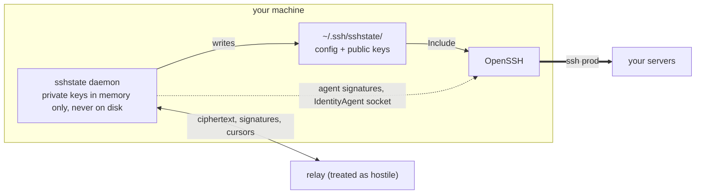

# sshstate: sync your SSH environment across machines

sshstate keeps your managed SSH hosts, connection options, trusted host keys and
credentials available on every machine you use, including headless ones. It is a
configuration and credential manager, **not** an SSH client or a terminal:
OpenSSH still owns the connection, and `ssh`, `scp` and editor remote
integrations keep working unchanged.



> **Status: v0.1.4, a stable MVP for single-user self-hosting on macOS and
> Linux.** Local and multi-device workflows work end to end and the sync
> protocol is frozen. Releases remain on the `0.x` line and may require
> coordinated client and relay upgrades. Windows is not supported.
>
> What comes next is in the [roadmap](docs/roadmap.md).

## How it works

Generated configuration lives under `~/.ssh/sshstate/`, reached by a single
`Include` line at the top of `~/.ssh/config`. Your hand-written entries are
never rewritten.

**Your machines hold the truth; the relay is optional.** A vault is created and
fully usable before any relay exists: add hosts and keys, install the `Include`,
connect. Adding a relay replicates the same vault to your other machines; it
never becomes the authority, and losing it is recovered from the machines
themselves.

**Private keys are never written to disk.** A per-user daemon implements the SSH
agent protocol on its own socket; hosts are pointed at it with `IdentityAgent`.
Only public keys reach the filesystem, and your global `SSH_AUTH_SOCK` is
untouched.

**The daemon is per-user and socket-activated.** launchd and systemd start it on
first use and it comes back locked; the control socket accepts only the owning
UID.

**The relay is treated as hostile.** It stores ciphertext, signatures and
cursors, and never receives a vault key, a password wrapper or a password
verifier ([threat model](docs/threat-model.md)). Device enrollment is
authenticated by comparing a full transcript fingerprint out of band, so a
malicious relay cannot substitute its own key during pairing.

**The vault is locked by default and expires.** Unlock is explicit. Idle expiry
is 15 minutes, refreshed by signing and by explicit vault commands but never by
status polling; hard expiry is 8 hours from password entry and cannot be
extended. A restarted or crashed daemon comes back locked.

**Nothing is overwritten silently.** A changed or conflicting host key is held as
a pending candidate for explicit resolution. Records carry per-record revisions
with exact parent matching, so a rejected edit survives as a conflict record
rather than being discarded or winning by arriving last
([sync protocol](docs/protocol.md)).

**Post-quantum from genesis.** ML-DSA-65 for signatures, age hybrid recipients
(ML-KEM-768 + X25519) for every envelope reaching a vault key. This protects
your synchronized infrastructure map (hostnames, usernames, ports, jump-host
topology), which is a long-lived secret with no public counterpart. It
does **not** meaningfully protect your SSH private keys, whose public halves are
already published in `authorized_keys` everywhere you connect; those are only as
post-quantum as the algorithms OpenSSH supports for authentication.

**No telemetry, ever.** Nothing is reported anywhere. Stated explicitly because
this tool holds SSH keys.

## Why choose sshstate

Password managers store SSH keys. Encrypted dotfile tools sync SSH files.
sshstate works on the layer between them: the environment those keys are used
in.

- **The environment is modelled, not copied.** Aliases, usernames, ports,
  jump-host topology, ordered key references and host trust travel together as
  records. A change on one machine arrives as a change, not as a file that
  replaced another file.
- **Headless machines are first-class.** A server, a container or a CI box gets
  the same environment as your laptop, with no desktop keychain to unlock and no
  GUI prompt waiting for an answer nobody is there to give.
- **Disagreement is surfaced, not settled for you.** File-based sync resolves a
  clash by picking a winner, usually whichever machine wrote last. sshstate
  stops and asks, because the loser of that race is a host you still need.

## Quick start

### Installation

sshstate is available on macOS and Linux. Choose the installation method that
best suits your system:

#### macOS

Install with [Homebrew](https://github.com/mouizahmed/homebrew-sshstate):

```sh
brew tap mouizahmed/sshstate
brew trust --formula mouizahmed/sshstate/sshstate
brew install sshstate
```

Homebrew 7 asks you to trust third-party formulas before installing them. The
command above trusts only the sshstate formula.

For a manual install, download the `darwin_arm64` (Apple Silicon) or
`darwin_amd64` (Intel) archive from
[GitHub Releases](https://github.com/mouizahmed/sshstate/releases), along with
`SHA256SUMS` and `SHA256SUMS.cosign.bundle`. In the download directory, run:

```sh
shasum -a 256 -c SHA256SUMS --ignore-missing
cosign verify-blob SHA256SUMS \
  --bundle SHA256SUMS.cosign.bundle \
  --certificate-identity-regexp '^https://github.com/mouizahmed/sshstate/' \
  --certificate-oidc-issuer https://token.actions.githubusercontent.com

tar xzf sshstate_*.tar.gz
sudo mv sshstate /usr/local/bin/
```

A browser-downloaded binary may be quarantined. If Gatekeeper blocks it after
verification, run `xattr -d com.apple.quarantine /usr/local/bin/sshstate`.
Homebrew installs do not need this step.

#### Linux

Signed packages for amd64 and arm64 are published to repositories hosted on
GitHub Pages. The repositories retain the five most recent stable releases;
older versions remain available on
[GitHub Releases](https://github.com/mouizahmed/sshstate/releases). They go live
with the next stable tag; v0.1.4 ships archives only.
Run each command block together; a failed key check stops installation.

<details>
<summary>Debian and Ubuntu (apt)</summary>

```sh
curl -fsSL https://mouizahmed.github.io/sshstate/keys/sshstate.gpg -o sshstate.gpg &&
echo '50383d7e016e1155acb59d5eb8761a657f17004bc65a507b8174a56971ade213  sshstate.gpg' | sha256sum -c - &&
sudo install -m 0644 sshstate.gpg /usr/share/keyrings/sshstate.gpg &&
echo 'deb [signed-by=/usr/share/keyrings/sshstate.gpg] https://mouizahmed.github.io/sshstate/apt stable main' | sudo tee /etc/apt/sources.list.d/sshstate.list >/dev/null &&
sudo apt update &&
sudo apt install sshstate
```

</details>

<details>
<summary>Fedora and other dnf distributions (dnf)</summary>

```sh
curl -fsSL https://mouizahmed.github.io/sshstate/keys/sshstate.asc -o sshstate.asc &&
echo '3e5cfef188d4c529ddba2faa2d9b0c34d109ef7984b453831c7553e167499cb9  sshstate.asc' | sha256sum -c - &&
sudo rpm --import sshstate.asc &&
sudo dnf config-manager addrepo --from-repofile=https://mouizahmed.github.io/sshstate/sshstate.repo &&
sudo dnf install sshstate
```

On dnf4 with `dnf-plugins-core`, use
`sudo dnf config-manager --add-repo https://mouizahmed.github.io/sshstate/sshstate.repo`
for the fourth command.

</details>

<details>
<summary>Alpine (apk)</summary>

```sh
curl -fsSL https://mouizahmed.github.io/sshstate/keys/sshstate.rsa.pub -o sshstate.rsa.pub &&
echo 'db487d22b47c13cb5c363101853a74e22eee52cf8044f2a948ebdd7cfc781fbe  sshstate.rsa.pub' | sha256sum -c - &&
sudo install -m 0644 sshstate.rsa.pub /etc/apk/keys/sshstate.rsa.pub &&
echo 'https://mouizahmed.github.io/sshstate/apk' | sudo tee -a /etc/apk/repositories >/dev/null &&
sudo apk update &&
sudo apk add sshstate
```

</details>

<details>
<summary>Arch Linux (pacman)</summary>

```sh
curl -fsSL https://mouizahmed.github.io/sshstate/keys/sshstate.asc -o sshstate.asc &&
echo '3e5cfef188d4c529ddba2faa2d9b0c34d109ef7984b453831c7553e167499cb9  sshstate.asc' | sha256sum -c - &&
sudo pacman-key --add sshstate.asc &&
sudo pacman-key --lsign-key C1E40ECEEA6F0117A52F1E70D16B79E07BBE57AA &&
printf '[sshstate]\nSigLevel = Required\nServer = https://mouizahmed.github.io/sshstate/arch/$arch\n' | sudo tee -a /etc/pacman.conf >/dev/null &&
sudo pacman -Syu sshstate
```

</details>

##### Manual archive

Download the `linux_amd64` or `linux_arm64` archive for your CPU from
[GitHub Releases](https://github.com/mouizahmed/sshstate/releases), along with
`SHA256SUMS` and `SHA256SUMS.cosign.bundle`. In the download directory, run:

```sh
sha256sum -c SHA256SUMS --ignore-missing
cosign verify-blob SHA256SUMS \
  --bundle SHA256SUMS.cosign.bundle \
  --certificate-identity-regexp '^https://github.com/mouizahmed/sshstate/' \
  --certificate-oidc-issuer https://token.actions.githubusercontent.com

tar xzf sshstate_*.tar.gz
sudo mv sshstate /usr/local/bin/
```

The archives cover amd64 and arm64. If you use Homebrew on Linux, the macOS
Homebrew commands above also install the Linux binary.

The `.rpm` attached to a GitHub release is unsigned. RPM signing happens when
the repository is built, so only its repository copy has a GPG signature. For
a manual `.rpm` download, verify `SHA256SUMS` with the cosign bundle as shown
above before installing it.

## Getting started with sshstate

Set up one machine first; add a self-hosted relay when you want to sync another.

### Set up the first machine

To bring existing SSH hosts and keys into sshstate:

```sh
sshstate setup --import ~/.ssh/config
sshstate status
sshstate doctor
ssh <alias>
```

`setup` creates a local vault and recovery kit, starts the daemon, imports the
hosts it can manage, and installs an `Include` in `~/.ssh/config`. It asks you to
confirm the recovery kit checksum and review matching host keys before changing
SSH configuration. Store the recovery kit separately from this machine: there is
no in-place vault-key rotation yet, planned for a future iteration, so the kit
and an encrypted export are the recovery path. A single machine does not need a
relay.

To start without importing an SSH config, run `sshstate setup`, then add a key
and host. Run `sshstate setup` again to finish installing the SSH `Include`:

```sh
sshstate setup
sshstate add-key ~/.ssh/id_ed25519
sshstate add prod --hostname 10.0.0.5 --user ubuntu --key <key-id-or-comment>
sshstate setup
ssh prod
```

The existing private key file stays where it is; sshstate stores an encrypted
copy in its vault and signs through its own agent. See the
[CLI flows](docs/cli-flows.md) for manual setup, trust review, backup, recovery,
and uninstall.

### Self-host the sync relay

A second machine needs a relay. Run it on a Linux host with Docker Compose,
persistent storage, a DNS name, and an HTTPS reverse proxy. The whole
deployment is one container and one SQLite volume; there is no separate
database service:

```yaml
services:
  relay:
    image: ghcr.io/mouizahmed/sshstate-server:v0.1.4
    restart: unless-stopped
    stop_grace_period: 30s
    read_only: true
    user: "65532:65532"
    security_opt:
      - no-new-privileges:true
    cap_drop:
      - ALL
    ports:
      - "127.0.0.1:8080:8080"
    volumes:
      - relay-data:/var/lib/sshstate
    secrets:
      - sshstate_bootstrap

volumes:
  relay-data:

secrets:
  sshstate_bootstrap:
    file: ./bootstrap.secret
```

[deploy/compose.yaml](deploy/compose.yaml) is the canonical file and adds
digest pinning and a local build target. Clone this repository on the server,
create the one-time bootstrap secret, and start the relay:

```sh
git clone https://github.com/mouizahmed/sshstate.git
cd sshstate
head -c 32 /dev/urandom | base64 > deploy/bootstrap.secret
chmod 600 deploy/bootstrap.secret
cp deploy/bootstrap.secret ~/bootstrap.secret.for-first-client
sudo chown 65532:65532 deploy/bootstrap.secret
cd deploy && docker compose up -d
```

Privately transfer the saved copy of the secret to the first machine. The
container runs as UID 65532 and listens only on server loopback port 8080, so
terminate TLS at your own reverse proxy: the public URL must use HTTPS. Two
things decide whether that proxy works. The relay verifies signatures over the
request authority, so the proxy has to pass the client's original `Host`
through unchanged; nginx rewrites it by default, and every request then fails
as an unverifiable signature. The relay has no WebSocket endpoint, so upgrade
headers are unnecessary.

[deploy/README.md](deploy/README.md) has the proxy configuration to copy, along
with image verification, upgrades, backups, and moving a relay between hosts.
Back up the persistent relay volume.

Once `https://relay.example.com` reaches the relay, connect the existing vault
from the first machine:

```sh
sshstate unlock
sshstate connect https://relay.example.com --bootstrap-secret /path/to/bootstrap.secret
sshstate status  # copy the vault ID
```

The bootstrap secret is consumed by this first connection. On a fresh second
machine, install sshstate but do not create a vault. Pair it with the first:

```sh
# second machine
sshstate pair https://relay.example.com <vault-id>

# first machine, using the session ID printed above
sshstate approve <session-id>
```

Compare all 13 groups of the pairing fingerprint through a channel other than
the relay and confirm on both machines. Then finish on the second machine:

```sh
sshstate setup
sshstate sync
sshstate doctor
```

Run `sshstate sync` on each machine after making changes. Conflicting edits are
kept for explicit review with `sshstate conflicts`; they are not resolved by
last-write-wins. The [CLI flows](docs/cli-flows.md) cover additional machines,
revocation, and recovery.

## Contributing

sshstate is open source, and contributions are welcome. Bug reports, fixes,
documentation improvements, and feature proposals are all useful. See
[CONTRIBUTING.md](CONTRIBUTING.md) for the contribution guidelines.

## License

MIT. See [LICENSE](LICENSE).
